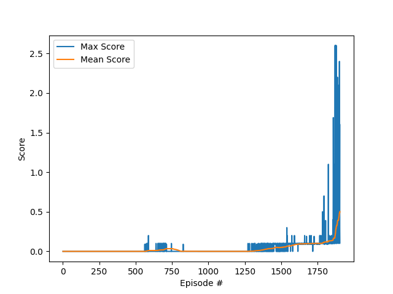

# Report
The project involved training two agents to play tennis. This is a collaboration reinforcement learning problem where two agents are dependent on each other to play the game and receive the highest reward. 

## The Environment
Two agents control rackets. The goal is to bounce a ball over a net for as long as possible.
- **Observation space**: 8 variables.
- **Action space**: 2 continuous actions.
- **Rewards**:
  - If an agent hits the ball over the net, it receives a **reward of +0.1**.
  - If an agent lets the ball hit the ground or hits the ball out of bounds, it receives a **reward of -0.01**.
  - In any other situation, the agent receives a **reward of 0**.

The task is episodic, and in order to solve the environment, the agents must get an average score of +0.5 (over 100 consecutive episodes, after taking the maximum over both agents). 


Description of the files in the repository:
| File | Description |
| --- | --- |
| `train.py` | The script to train the agents |
| `run.py` | The script to run the trained agents |
| `maddpg_agent.py` | The implementation of the MADDPG agent class |
| `model.py` | The implementation of the actor and critic networks |
| `checkpoint_actor.pth` | The trained actor network weights |
| `checkpoint_critic.pth` | The trained critic network weights |

# Learning Algorithm
In this project, two agents are required to collaborate in order to receive the highest possible score. [MADDPG](https://arxiv.org/abs/1706.02275) (Multi-Agent Deep Deterministic Policy Gradients) is an algorithm that is well suited for this type of problem. MADDPG is an extension of DDPG, which is a model-free, off-policy algorithm for learning continuous action spaces. The algorithm uses a centralized critic and decentralized actor. It was first introduced in The critic is trained with the observations and actions of all agents, while the actor is trained with only its own observations. The algorithm uses a replay buffer and soft updates to the target networks. 

Here's a breakdown of the key components of the MADDPG algorithm:

1. **Actor-Critic Architecture:**: 
  
   - MADDPG uses a centralized critic and decentralized actor. In other words, each actor has its own policy network, but there is a single critic network responsible for estimating the action-value function, taking in actions and observations from all agents. 
  
   - **The Actors**: Each agent has a copy of the same neural network, responsible for learning the optimal policy for a given state. The actor network outputs a **deterministic** action.
     - Network Architecture:
       - The actor network consists of **3 fully connected layers** with 400, 300 and 2 (similar to action size) nodes respectively. 
       - The input to the network is the state vector of size 8 - the observation space size.
       - The first layer is followed by a **ReLU** activation function, and then by **Batch Normalization** to normalize the input to the next layer. This improves stability.
       - The second layer is followed by a **ReLU** activation function.
       - The final layer is followed by a **tanh** activation function, because the action space is continuous between -1 and 1.
  
       The code for the actor network is as follows:
        
        ```python
        class Actor(nn.Module):
        """Actor (Policy) Model."""

            def __init__(self, state_size, action_size, seed, fc1_units=400, fc2_units=300):
                """Initialize parameters and build model.
                Params
                ======
                    state_size (int): Dimension of each state
                    action_size (int): Dimension of each action
                    seed (int): Random seed
                    fc1_units (int): Number of nodes in first hidden layer
                    fc2_units (int): Number of nodes in second hidden layer
                """
                super(Actor, self).__init__()
                self.seed = torch.manual_seed(seed)
                self.fc1 = nn.Linear(state_size, fc1_units)
                self.bn1 = nn.BatchNorm1d(fc1_units)
                self.fc2 = nn.Linear(fc1_units, fc2_units)
                self.fc3 = nn.Linear(fc2_units, action_size)
                self.reset_parameters()

            def reset_parameters(self):
                self.fc1.weight.data.uniform_(*hidden_init(self.fc1))
                self.fc2.weight.data.uniform_(*hidden_init(self.fc2))
                self.fc3.weight.data.uniform_(-3e-3, 3e-3)

            def forward(self, state):
                """Build an actor (policy) network that maps states -> actions."""
                if state.dim() == 1:
                    state = torch.unsqueeze(state, 0)
                x = F.relu(self.fc1(state))
                x = self.bn1(x)
                x = F.relu(self.fc2(x))
                return F.tanh(self.fc3(x))
        ```

    - **The Critic**: The critic evaluates the actions chosen by the actors by estimating the expected cumulative reward from a given state-action pair. It helps the actors learn which actions are more likely to lead to higher rewards. The algorithm uses a single critic network.
  
      -  Network Architecture:
         - The critic network consists of **3 fully connected layers** with 400, 300, 1 nodes respectively. 
         - The input to the network is the state vector of size 8 - the observation space size, and the action vector of size 2 - the action space size, which is concatenated to the input of the second layer.
         - The first layer is followed by a **ReLU** activation function, and then by **Batch Normalization** to normalize the input to the next layer. This improves stability.
         - The second layer is followed by a **ReLU** activation function. The input to this layer is the concatenation of the output of the first layer and the action vector.
         - The third layer is followed by a **ReLU** activation function.
         - The final layer is the output layer, which outputs a single value (Q-value).
  
         The code for the critic network is
        
            ```python
            class Critic(nn.Module):
                """Critic (Value) Model."""

                def __init__(self, state_size, action_size, seed, fcs1_units=400, fc2_units=300):
                    """Initialize parameters and build model.
                    Params
                    ======
                        state_size (int): Dimension of each state
                        action_size (int): Dimension of each action
                        seed (int): Random seed
                        fcs1_units (int): Number of nodes in the first hidden layer
                        fc2_units (int): Number of nodes in the second hidden layer
                    """
                    super(Critic, self).__init__()
                    self.seed = torch.manual_seed(seed)
                    self.fcs1 = nn.Linear(state_size, fcs1_units)
                    self.bn1 = nn.BatchNorm1d(fcs1_units)
                    self.fc2 = nn.Linear(fcs1_units+action_size, fc2_units)
                    self.fc3 = nn.Linear(fc2_units, 1)
                    self.reset_parameters()

                def reset_parameters(self):
                    self.fcs1.weight.data.uniform_(*hidden_init(self.fcs1))
                    self.fc2.weight.data.uniform_(*hidden_init(self.fc2))
                    self.fc3.weight.data.uniform_(-3e-3, 3e-3)

                def forward(self, state, action):
                    """Build a critic (value) network that maps (state, action) pairs -> Q-values."""
                    if state.dim() == 1:
                        state = torch.unsqueeze(state, 0)
                    xs = F.relu(self.fcs1(state))
                    xs = self.bn1(xs)
                    x = torch.cat((xs, action), dim=1)
                    x = F.relu(self.fc2(x))
                    return self.fc3(x)
            ```

2. **Experiences Replay**: MADDPG uses a replay buffer to store experiences. Each actor contributes to the same replay buffer. Then, each actor also samples from the same, single replay buffer. This allows the agents to learn from the experiences of the other agent as well, which is important in a collaborative environment, since both agents need to be able to handle the same observations, but they don't necessarily experience them during the game.
3. The reset of the algorithms includes **Target Networks with Soft Updates** and **Ornstein-Uhlenbeck Noise** for exploration, similar to DDPG.

## Hyperparameters

```python
BUFFER_SIZE = int(1e5)  # replay buffer size
BATCH_SIZE = 256        # minibatch size
GAMMA = 0.99            # discount factor
TAU = 1e-3              # for soft update of target parameters
LR_ACTOR = 1e-4         # learning rate of the actor 
LR_CRITIC = 1e-4        # learning rate of the critic
WEIGHT_DECAY = 0        # L2 weight decay
```

## Training Results

The following plot describes the maximum of the cumulative reward of each agent, and the average of the maximum **reward over 100 episodes**. The environment is considered solved when the average reward over 100 episodes is at least +0.5.

```bash
Environment solved in 1803 episodes!    Average Score: 0.50
```



## Ideas for Future Work
1. Noise reduction: The agents could benefit from a more sophisticated noise process. As the agents learn, the noise process could be annealed to decrease the exploration.
2. Prioritized Experience Replay: The agents could benefit from prioritized experience replay, which would allow them to learn more from the experiences that matter the most.